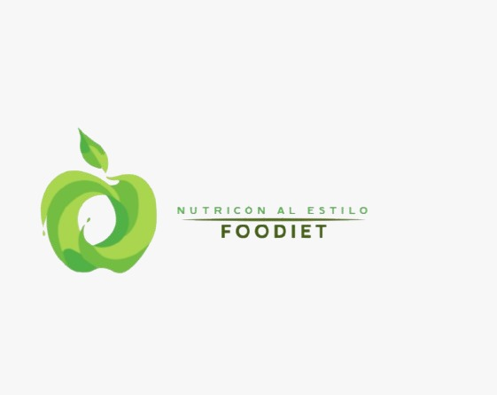

<p align="center">
  
</p>

<h1 align="center">FooDiet</h1>
<p align="center"><i>Aplicación de gestión nutricional y dietética</i></p>

---

## Índice

1. [Integrantes del grupo](#integrantes-del-grupo)
2. [Cómo está organizado el repositorio](#cómo-está-organizado-el-repositorio)
3. [Frontend: páginas web](#frontend-páginas-web)
4. [Base de datos](#base-de-datos)
5. [Backend en Java](#backend-en-java)
6. [Configuración del entorno](#configuración-del-entorno)

---

## 👥 Integrantes del grupo

El proyecto lo hemos desarrollado entre cuatro personas, cada una responsable de su subsistema:

| Nombre | GitHub | Subsistema |
|---|---|---|
| Andrei Veres | [@d-reii](https://github.com/d-reii) | Gestión de Profesionales |
| Daniel Dimitrov | [@Danielodim](https://github.com/Danielodim) | Pacientes y Citas |
| Octavian Matei | [@ttaavii](https://github.com/ttaavii) | Planes Alimenticios |
| Itzel Bethania | [@Itzelcor](https://github.com/Itzelcor) | Estadísticas y QC |

---

## 📁 Cómo está organizado el repositorio

La estructura de carpetas separa el código por responsabilidad para que cada miembro trabaje en su parte sin pisar la de los demás:

```
FOODIET/
├── backend/src/       ← lógica en Java (POO + DAO)
├── frontend/          ← páginas HTML5 y hojas de estilo
└── docs/              ← documentación y scripts SQL
```

> [!NOTE]
> Cada developer trabaja en su propia subcarpeta dentro de `frontend/` y `backend/`. Si necesitas tocar algo de otro compañero, avísale primero.

---

## 🌐 Frontend: páginas web

La interfaz está construida con **HTML5**, **Bootstrap 5** y una hoja de estilos compartida (`css/estilos.css`).

### Colores del proyecto

El equipo acordó una paleta verde para toda la aplicación. Está definida en `estilos.css` con variables CSS:

```css
:root {
    --verde-principal: #2e7d32;
    --verde-oscuro:    #1b5e20;
    --verde-claro:     #4caf50;
    --blanco:          #ffffff;
    --gris-claro:      #f5f5f5;
}
```

Todos los archivos `.html` del proyecto importan esta hoja de estilos para mantener la coherencia visual.

### Páginas públicas

Estas páginas las ve cualquier visitante sin necesidad de registrarse:

- **`index.html`** — página de inicio con los servicios de la clínica
- **`quienes-somos.html`** — información del equipo de nutricionistas
- **`servicios.html`** — planes disponibles y tarifas
- **`contacto.html`** — formulario de contacto para nuevos pacientes

### Área privada

Solo accesible tras iniciar sesión:

- **`acceso.html`** — login y registro rápido con selector de rol (paciente / nutricionista)
- **`registro-paciente.html`** — ficha de alta con datos físicos (edad, peso, altura) e historial clínico
- **`solicitar-cita.html`** — reserva de citas con opción de modalidad presencial u online
- **`historial-paciente.html`** — seguimiento de citas pasadas, observaciones y plan de alimentación activo

> [!TIP]
> Las páginas del área privada usan las clases `navbar-custom` y `footer-custom` definidas en `estilos.css`. No las modifiques sin avisar al equipo — afecta a todas las páginas a la vez.

---

## 🗄️ Base de datos

**Archivo principal:** `foodiet_completo.sql`

El esquema relacional da soporte a todos los formularios del frontend. Está dividido en 5 scripts que hay que ejecutar en orden:

```sql
-- 1. Base compartida (tabla usuario)
source SQL_00_BASE.sql;

-- 2. Pacientes, alergias
source SQL_01_DANI_pacientes.sql;

-- 3. Profesionales, citas y facturas
source SQL_02_SERGIO_profesionales_citas.sql;

-- 4. Planes, menú diario, alimentos
source SQL_03_TAVI_planes.sql;

-- 5. Progreso, métricas e informes
source SQL_04_ITZEL_estadisticas.sql;
```

Ejemplo de tabla del sistema:

```sql
CREATE TABLE paciente (
    id_paciente    INT          NOT NULL AUTO_INCREMENT,
    id_usuario     INT          NOT NULL,
    dni            VARCHAR(9)   NOT NULL,
    nombre         VARCHAR(50)  NOT NULL,
    apellidos      VARCHAR(100) NOT NULL,
    altura         DECIMAL(5,2) NOT NULL,
    fecha_registro DATE         NOT NULL,
    CONSTRAINT PK_paciente PRIMARY KEY (id_paciente),
    CONSTRAINT UQ_paciente_dni UNIQUE (dni)
);
```

> [!WARNING]
> No ejecutes los scripts en un orden diferente. Las claves foráneas dependen de que las tablas anteriores existan.

---

## ☕ Backend en Java

El backend procesa los datos del frontend usando programación orientada a objetos. El código está organizado por subsistema dentro de `backend/src/`:

```
backend/src/main/java/foodiet/
├── estadisticas/    ← Itzel
├── pacientes/       ← Dani
├── planes/          ← Tavi
└── citas/           ← pendiente
```

Ejemplo de método del subsistema de Estadísticas:

```java
// Devuelve el IMC medio de todos los pacientes registrados
public double imcMedio() {
    double suma = 0;
    for (int i = 0; i < totalPacientes; i++) {
        suma += matrizDatos[i][2];
    }
    if (totalPacientes > 0) {
        return Math.round((suma / totalPacientes) * 100.0) / 100.0;
    }
    return 0;
}
```

Las pruebas unitarias están en `backend/src/test/java/foodiet/` y se ejecutan con Maven:

```bash
cd backend
mvn test
```

Resultado actual: ✅ **9 tests, 0 fallos**

> [!NOTE]
> Necesitas Java 17 o superior y Maven instalado. Si `mvn` no se reconoce en la terminal, comprueba que esté en el PATH del sistema.

---

## ⚙️ Configuración del entorno

Para arrancar el proyecto en local necesitas:

1. **Clonar el repositorio**
```bash
git clone https://github.com/Itzelcor/FOODIET.git
cd FOODIET
```

2. **Crear la base de datos** — ejecuta los scripts SQL en orden desde MySQL Workbench o la terminal

3. **Abrir el frontend** — abre cualquier `.html` directamente en el navegador o usa Live Server en VSCode

4. **Ejecutar los tests**
```bash
cd backend
mvn test
```

> [!CAUTION]
> No hagas push directamente a `main` ni a `development`. Lee el archivo [CONTRIBUTING.md](CONTRIBUTING.md) antes de subir cualquier cambio al repositorio.

---

<p align="center"><i>© 2026 FooDiet · IES Font de San Lluis · 1º DAW</i></p>
